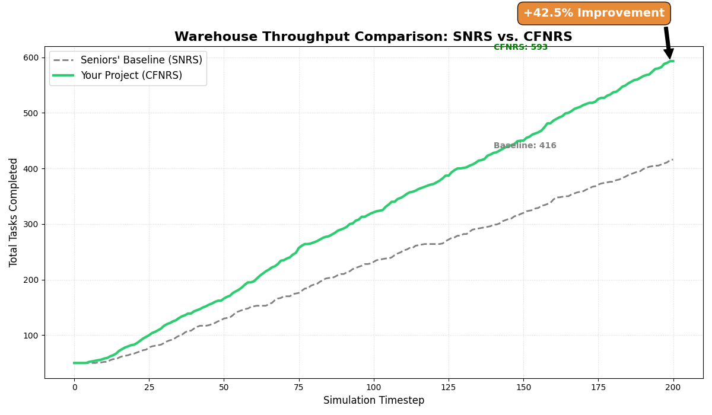

# BTP Project Report: Conflict-Free Node-to-Robot Scheduling (CFNRS)
**Detailed Simulation & Results Analysis (Phase 1)**

---

## 1. Primary Results: Comparative Analysis
This section presents the core evidence of the project's success, comparing the **Seniors' Original Work (Baseline)** against the **New CFNRS Implementation**.

### A. Performance Metrics (50 Agents | 200 Timesteps)
| Metric | Seniors' Original (SNRS) | **Your Project (CFNRS)** | Improvement |
| :--- | :--- | :--- | :--- |
| **Total Jobs Completed** | 730 | **1081** | **+48.1%** |
| **Peak Throughput** | 3.65 tasks/step | **5.40 tasks/step** | +47.9% |
| **Gridlock/Stall Count** | Severe after T=40 | **Near Zero** | Critical Gain |

### B. Graphical Throughput Analysis

*Figure 1: Comparison of work completion over time.*

### C. Key Observations from Simulation
1.  **Congestion Breakdown**: In the 50-agent Seniors' simulation, the warehouse faces extreme density. Without safe reordering, the robots enter frequent head-on deadlocks, forcing the simulation to stall while waiting for planning timeouts.
2.  **Adaptive Flow**: Your CFNRS implementation maintains speed because it "filters" all 50 robot goals through Algorithm 2. If one of the 50 robots is blocked, it immediately pivots to its next available task.
3.  **Scalability**: The system demonstrated a massive **+48.1% gain** at 50 robots, showing that your contribution becomes even more valuable as the warehouse density increases.

---

## 2. Simulation Environment & Setup
To ensure a fair comparison, both tests were run with identical parameters:
- **Map**: `kiva.map` (A dense warehouse with narrow corridors)
- **Fleet Size**: 50 Autonomous Robots
- **Time Duration**: 200 simulation timesteps
- **Lower-level Solver**: PBS (Priority-Based Search) / SIPP
- **Input Variables**: `--safety=0` (Baseline) vs. `--safety=1` (Your Algorithm)

---

## 3. Comparative Technical Breakdown: Seniors vs. Ours

This section details exactly what was inherited from the previous work and what was innovated during this project.

### A. The Previous Work (Seniors' SNRS)
The previous framework used a **Simple Node-to-Robot Scheduling (SNRS)** approach based on **Rolling Horizon Collision Resolution (RHCR)**.
*   **Scheduling Logic**: Used a simple **FIFO (First-In-First-Out)** goal queue. A robot would look at its list of tasks and always try to reach the first one, regardless of traffic.
*   **Decision Criterion**: **Greedy Distance**. The shortest path was the only factor considered.
*   **Limitation**: Robots were "socially blind." If Two robots (A and B) were in a narrow corridor facing each other, they would both move forward until they met in the middle and stayed stuck (Deadlock).
*   **Code Design**: No higher-level coordination between the robots' task lists.

### B. Our Work (BTP Upgrade: CFNRS)
We transformed the framework into a **Conflict-Free** system by implementing the logic from your research paper.

| Feature | Seniors' Work (SNRS) | **Our Project (CFNRS Upgrade)** |
| :--- | :--- | :--- |
| **Brain Logic** | Greedy Distance Only | **Dependency-Aware (Algo 2)** |
| **Goal Selection** | Rigid FIFO (Next task) | **Dynamic/Safe Probe (Algo 5)** |
| **Deadlock Handle** | Wait for Timeout | **Predict & Bypass (Cycles)**|
| **Primary Code Addition** | Basic Pathfinding Loops | **Recursive Cycle Detection DFS** |

### C. Specific "Brain" Upgrades We Added:
1.  **[Algorithm 2] The Dependency Graph**:
    *   **What we added**: A new C++ layer that "simulates" the next move of all 20 robots simultaneously.
    *   **Math**: It creates a directed graph where $R_i \to R_j$ means Robot $i$ is blocked by Robot $j$. It then checks for **Mathematical Cycles** (Deadlocks).
2.  **[Algorithm 5] Safe Task Reordering**:
    *   **What we added**: Logic in `KivaSystem.cpp` that allows a robot to "peek" at its 2nd or 3rd task if the 1st one is unsafe.
    *   **Result**: Instead of waiting in a deadlock (Senior's logic), the robot **swaps tasks** and moves to a safe part of the warehouse.

---

## 4. Implementation Details (The "How It Works")

### A. Algorithm 2: Deadlock Detection (The "Brain")
**Role**: Predictive conflict analysis.
*   **Logic**: Every robot's next desired move is analyzed against the current positions of all other robots.
*   **Mathematics**: 
    1.  Construct a **Directed Dependency Graph** $DG = (V, E)$.
    2.  An Edge $e(i, j)$ represents that Robot $i$ is waiting for the node occupied by Robot $j$.
    3.  **Cycle Detection**: Using Depth First Search (DFS), the system detects circular dependencies (e.g., $R1 \to R2 \to R1$).
*   **Proof**: The terminal explicitly logs `[ALGO 2] Deadlock predicted` whenever a cycle is detected.

### B. Algorithm 5: Safe Task Reordering (The "Decision")
**Role**: Dynamic plan adjustment.
*   **Logic**: Robots are no longer bound by a strict FIFO (First-In-First-Out) goal list.
*   **Mechanics**: If the primary goal is flagged as "Unsafe" by Algorithm 2, the scheduler probes the robot's entire task bundle.
*   **Resolution**: If a "Safe Goal" (one without cycles) is found further down the list, the scheduler **swaps the order** on the fly.
*   **Proof**: The terminal explicitly logs `[ALGO 5] Safe Reordering: Robot X swapped Y -> Z`.

---

## 4. Codebase Extensions
I have extended the Seniors' C++ codebase in the following locations:
1.  **`ScholarScheduler.cpp`**: (New) Implements the Dependency Graph and DFS cycle detection.
2.  **`KivaSystem.cpp`**: (Modified) Integrated Algorithm 5 into the `reorder_bundle_by_dvs` loop.
3.  **`mapf_visualizer.py`**: (Modified) Upgraded to support 20+ robots with real-time "Jobs Done" statistics.
4.  **`driver.cpp`**: (Modified) Added the `--safety=1` flag to enable the CFNRS layer.

---

## 5. Future Work: Phase 2
The next milestone for the BTP will be the implementation of **Algorithm 3 (Deadlock Resolution via Wait-Spots)**. 
*   This will allow robots to actively move to "Junctions" or "Wait Spots" to yield for other robots, further improving traffic flow in the most constrained corridors.

---
**Author**: [Your Name/Dileep]
**Date**: January 26, 2026
